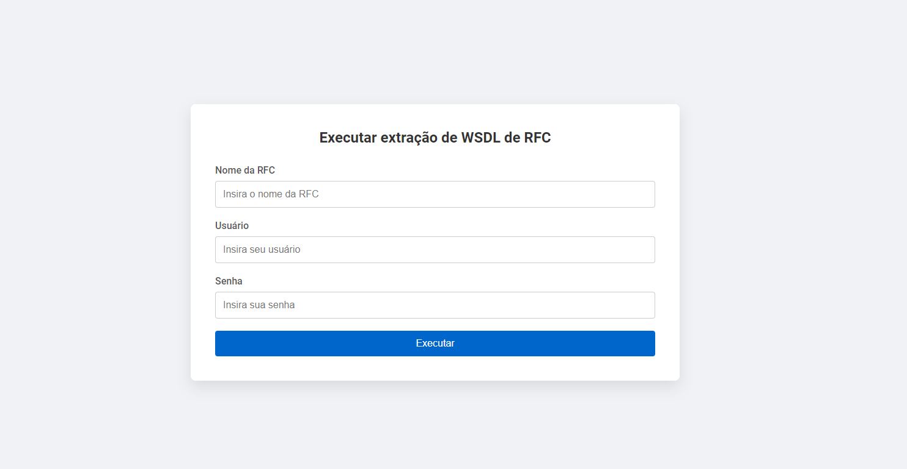

# WSDL Extractor

<p>    
  
</p>



#### Comandos importantes para execução

```sh
npm run dev
```

```sh
npm run build
```

```sh
npm run start
```

WSDL Extractor é um projeto para extração de um arquivo WSDL a partir de um endpoint SAP para gerar 4 arquivos a serem utilizados no mapping de um Integration Flow no SAP BTP

## 🚀 Como Utilizar

#### Preparar o projeto

- Baixe o repositório e navegue até a paste raiz do projeto
- Preencha as variáveis de ambiente
- Instalar as dependências: `npm install`
- Executar em modo de desenvolvimento `npm run dev`
- Executar em modo de produção `npm run build` e em seguida `npm run start`
- Abrir o WebApp acessando http://localhost:PORTA

> 💡 Lembrar de preencher as variáveis de ambiente

## 📝 Notes

- Aproveite essa maravilha da tecnologia.